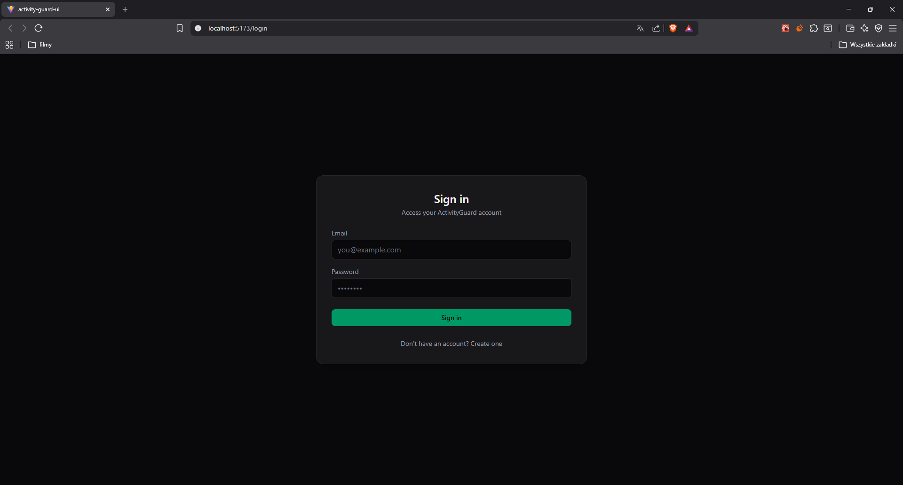
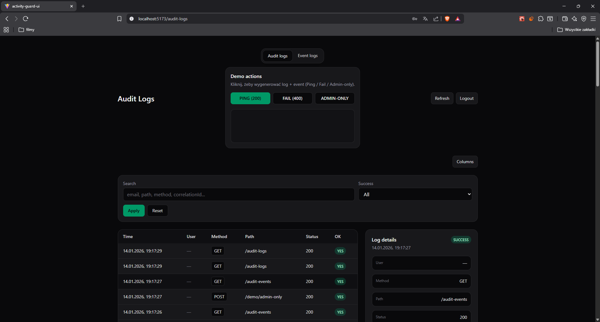
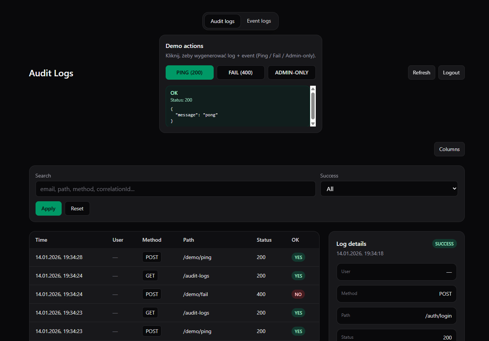
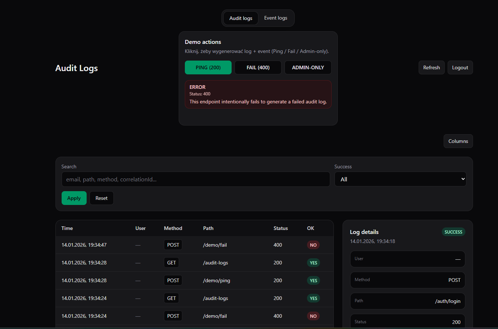
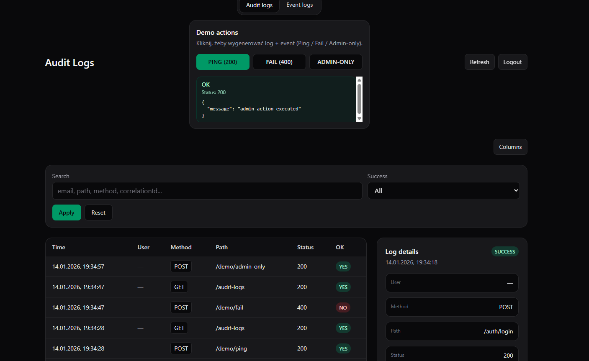
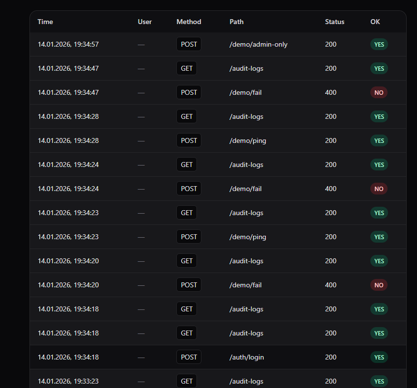
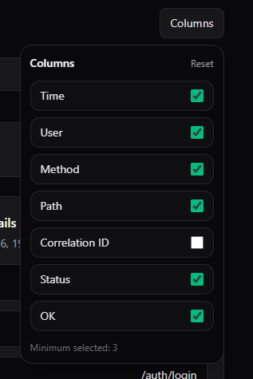
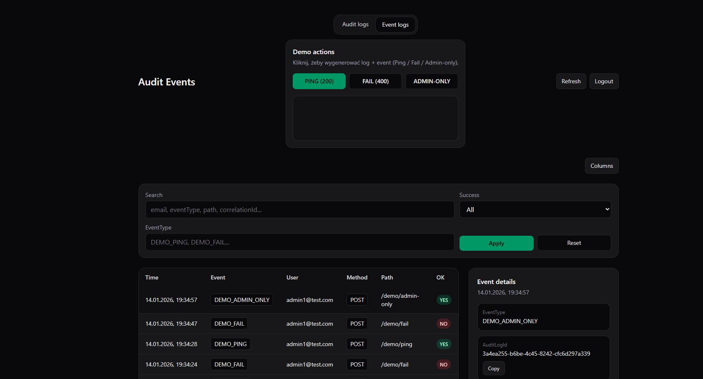
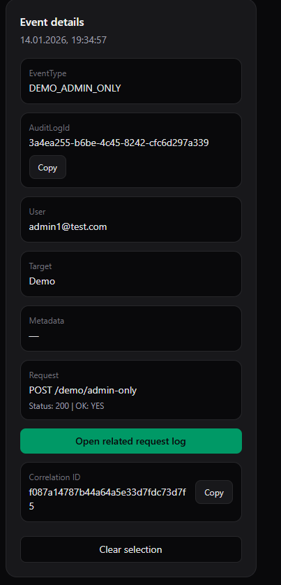
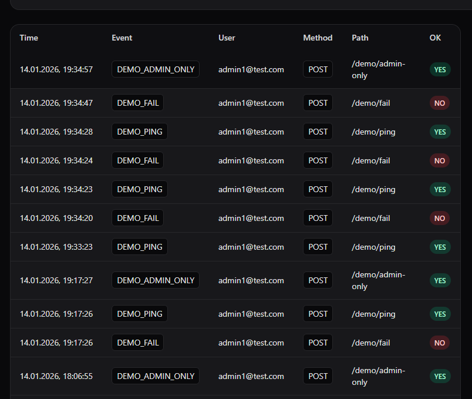

🛡️ ActivityGuard

User Activity & Audit System (POC)

ActivityGuard is a Proof of Concept application that demonstrates how to build a robust audit and user activity tracking system using .NET (backend) and React + TypeScript (frontend).

The project focuses on architecture, observability, and traceability, rather than being a simple CRUD app.

🎯 Goal of the project

The main goal of ActivityGuard is to show:

how to track HTTP requests (Audit Logs),

how to record meaningful domain actions (Audit Events),

how to correlate multiple actions with a single request,

how to design a clean, layered architecture,

and how to present audit data in a clear admin UI.

This project was built as a portfolio POC, not a production-ready system.

🧩 Core concepts

1️⃣ Audit Log (request-level)

Represents one HTTP request handled by the API.

Stored automatically by middleware and contains:

timestamp

user (if authenticated)

HTTP method

request path

status code

success flag

IP address

user-agent

correlationId

Example:

POST /demo/ping → 200 OK

2️⃣ Audit Event (domain-level)

Represents what actually happened inside the system as a result of a request.

Stored explicitly by application services / controllers.

Contains:

event type (e.g. DEMO_PING, DEMO_FAIL)

actor (user)

optional target (type + id)

optional metadata (JSON)

reference to the related AuditLog

Example:

User triggered DEMO_PING action

3️⃣ Correlation ID

Each HTTP request gets a Correlation ID, which allows you to:

connect multiple audit events to a single request,

navigate from event → request log and vice versa,

debug and trace user behavior across layers.

🏗️ Architecture overview

Backend (.NET)

ActivityGuard.Api

├─ Controllers

├─ Middleware (AuditMiddleware)

└─ Auth / JWT setup

ActivityGuard.Application

├─ Services (AuthService, AuditEventService)

├─ DTOs

└─ Interfaces

ActivityGuard.Domain
├─ User

├─ AuditLog

└─ AuditEvent

ActivityGuard.Infrastructure

├─ EF Core (SQL Server)

├─ Repositories

└─ Security (JWT, password hashing)

Key points:

- Clean separation of concerns
- No EF Core leaking into Application layer
- Audit is non-breaking (audit failures never break requests)

Frontend (React + TypeScript)

pages/

├─ Login / Register

├─ AuditLogsPage

└─ AuditEventsPage

components/

├─ AdminPageLayout

├─ ColumnPicker

├─ Tables / Filters / Details panels

└─ DemoActionsPanel

Key features:

- Protected routes
- Admin layout
- Right-side details panel
- Column picker (per-user, stored in localStorage)
- Filters and search
- Navigation between related logs and events
- Auto-refresh after demo actions

🧪 Demo actions

The app contains demo endpoints to generate audit data:

PING – successful request (200)

FAIL – failed request (400)

ADMIN-ONLY – role-protected endpoint

Each action:

creates an AuditLog

creates one or more AuditEvents

shares the same correlationId

This allows easy testing and presentation.

🔐 Authentication & Authorization

JWT-based authentication

Roles: User, Admin

Audit pages available only for Admin users

Token stored on frontend and attached to API requests

🖥️ UI highlights

Two main admin views:

Audit Logs – request-level view

Audit Events – business-level view

Right-side details panel

Click-through navigation:

event → related request log

Configurable visible columns

Clean, minimal Tailwind-based UI

🗄️ Persistence

SQL Server

EF Core

Audit data stored in relational form:

AuditLogs

AuditEvents (linked via AuditLogId)

⚠️ Notes / limitations

IP address may appear as ::1 when running locally (IPv6 localhost)

Demo actions intentionally simplify actor/target logic

This is a POC, not a production-ready audit system

🚀 Why this project?

This project was built to demonstrate:

system design thinking

audit & observability patterns

clean architecture in practice

realistic admin UI, not just CRUD forms

It is intended as a portfolio project for backend / fullstack roles.

📸 Screenshots
Audit Logs
Login

Audit Page

Demo Ping

Demo Fail

Demo AdminOnly

Log Details

Log Columns

Column Selection

Audit Events

Audit Events Page

Audit Events Details

Audit Events

🧠 Possible extensions (not implemented)

Saved filters per user
Export to CSV / JSON
Pagination / infinite scroll
External application ingestion
Real-time updates (SignalR)

👤 Author

Jakub Owczarek
